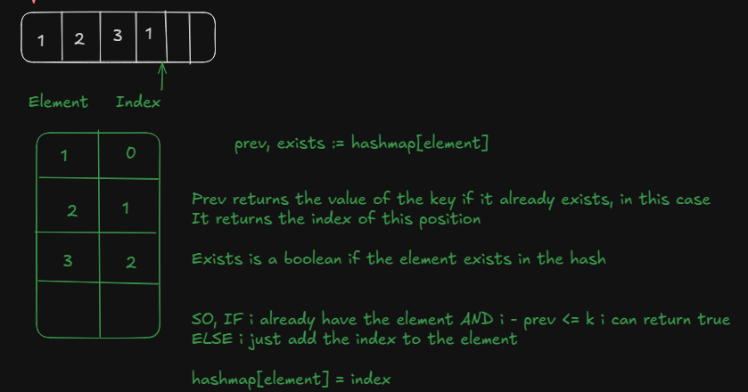

## Sliding Window

Sliding window is a technique used to solve problems that we need to find or check a subarray that satisfies a given condition.Once the condition is met, we return the indexes, a boolean value, or some other result.

I really like this ([Contains Duplicate II](https://leetcode.com/problems/contains-duplicate-ii/)) and the idea for solving it:

The main idea here is to use a hashmap in this way:

- The "Key" of the hashmap is our value/element in the array
- The "Value" of the "Key" of the hashmap is the index that the element appears

With this two points in mind, we have everything we need to solve it:

We iterate through the array of integers and check:

- If the current element already exists in our hashmap, we satisfy the condition `nums[i] == nums[j]`, because if already exists we have two occurrences of the same number
- If the difference between their indexes (j - i ) is less or equal to K, we return true

I used Go for this solution:

```go
func containsNearbyDuplicate(nums []int, k int) bool {
	// Create the hashmap
	h := make(map[int]int)

	// Iterate over the array
	for index,element := range nums {
		// Get the previous Index in the hashmap if the element exists
		prevIndex, elementExists := h[element]

		// Check if the element have two occurrences(nums[i] == nums[j])
		// and if the index difference (index - prevIndex) is <= k
		if elementExists && index - prevIndex <= k {
			return true
		}
		// If the elemnt doesn't exist we add it to the hashmap
		h[element] = index
	}
	return false
}
```

---

```cs
bool ContainsNearbyDuplicate(int[] nums, int k) {
  Dictionary < int, int > dic = new Dictionary < int, int > ();
  var end = 0;
  while (end < nums.Length) {
    int element = nums[end];
    if (dic.TryGetValue(element, out int value) && Math.Abs(end - value) <= k) {
      return true;
    }

    dic[element] = end;
    end++;

  }

  return false;
}
```

The idea is the same for both codes above.

Here is a simple sketch describing the logic I used for solving this problem (with go, but the idea is the same with C#)

