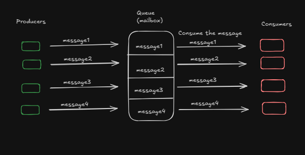

## Introduction

### What can you expect from this blog

The reader will learn how and why implement queue services on a .net application, beyond learning the concept of the VSA and how to setup a docker compose for this application

### Prerequisites

Familiarity with .NET, Docker, concepts of API and RESTful principles, a little about DDD and knowledge on the c# language.

### Building a Voting System?

I don't exactly remember when, but I came across this [challenge](https://dev.to/zanfranceschi/desafio-sistema-de-votacao-bbb-50e3)through a tweet.

It talks about a discussion about how we Brazilians were thinking about how a website from a reality show could support thousands of requests per second and still have a fast response time.

In this article, the author introduces the concept of queue services and how they can help to support these thousands of requests. It basically consists of two steps:

1. The API receives a request to vote for a candidate, then publishes this vote on a queue, and as soon as possible, the API returns some kind of Vote accepted (202)
2. Then the next step is to actually save this vote into a database. We create a consumer that will run asynchronously to consume the queue and save the vote into the database

The challenge suggests the use of RabbitMQ for solving it, and this is the one we will use. As for the programming language, feel free to choose any of your preference, but keep an eye on some concepts we will work on during this post:

- Background Workers
- Queue Services
- Integration with the database
- Vertical Slice Architecture

If you just want to check the implementation of the solution, you can go to this [repository](https://github.com/Viilih/VSA-voting-system) and read the README.md file with the instructions.

## Understanding Vertical Slice Architecture

### What is Vertical Slice Architecture? (VSA)

It's an architecture feature centered, where you divide your application by features and not other layers, such as Presentation, Application, Domain that is present on Clean Architecture. Here is a simple sketch about how VSA works:

The focus of the VSA is isolating each feature, creating a less coupled application between features, where each feature has its own files, services, and business logic.

### Advantages and disadvantages

In the application we are going to build, we will use the principles and concepts of the Vertical Slice Architecture.As with any other architecture, it has its own advantages and disadvantages:

Advantages:

- Each feature stands on its own
- Teams can work without stepping on each other's toes
- Less coupling
- Easy to understand what your application does

Disadvantages:

- You might write similar or identical code more than once
- Shared features need careful planning
- You might have a lot of files in your application due to feature separation

### When to use VSA?

Well the answer of the second question is: **It Depends**
As I said before each Architecture has their own Trade offs and you need to analyze it to choose the best one to ind the best one for your need.

In this application, I choose the VSA because the size of our application and the facility to implement the VSA.

### Resources for learning more

If you want to dive deep into this concept, here are some good resources for it:

- [Ways to implement Vertical Slice Architecture](https://antondevtips.com/blog/vertical-slice-architecture-the-best-ways-to-structure-your-project)
- [Intro to Vertical Slice Architecture](https://www.milanjovanovic.tech/blog/vertical-slice-architecture)
- [Vertical Slice Architecture](https://www.jimmybogard.com/vertical-slice-architecture/)
- [Vertical Slice implementation](https://www.youtube.com/watch?v=T-EwN9UqRwE&t=1471s)

NOTE: The focus of this post is to solve the challenge that I will go through in the next paragraphs, but I believe it's important to contextualize you, my reader, about the way we are going to implement the solution.

## Project Setup and Implementation

### Initial project setup

To set up the structure we are gonna use you can just copy this into your terminal, basically it creates a solution and add an api to the src folder:

```cs
# Create a new solution
dotnet new sln -n voting-system

# Create project folders
mkdir src mkdir "Solution Items"

# Navigate to src folder and create a web API project
cd src
dotnet new webapi -n votingSystem.Api --no-minimal

# Create test directory inside src
mkdir test

# Add the API project to the solution cd ..
dotnet sln add src/votingSystem.Api/votingSystem.Api.csproj

dotnet add package FluentResults --version 3.16.0
```

After that, we are ready to to start our project

### Domain entities (Candidate and Vote)

Well the challenge involves basically two entities:

- Candidate - Represents a candidate who can receive votes.
- Vote - Represents an individual vote cast for a candidate.
  Since a candidate can receive multiple votes as the voting period continues, let’s define these entities in the **Domain** folder:

```cs
// votingSystem.Api/Domain/Candidate.cs
public class Candidate {
  public int Id {
    get;
    private set;
  }
  public string Name {
    get;
    private set;
  }

  public List <Vote> Votes {
    get;
    private set;
  }

  private Candidate(string name) {
    Name = name;
  }

  public static Result <Candidate> Create(string name) {
    if (string.IsNullOrWhiteSpace(name)) {
      return Result.Fail <Candidate> ("Name cannot be null or empty");
    }

    return Result.Ok(new Candidate(name));
  }
}
```

---

```cs
// votingSystem.Api/Domain/Vote.cs
public class Vote {
  public Guid Id {
    get;
    private set;
  }

  public int CandidateId {
    get;
    private set;
  }

  public virtual Candidate Candidate {
    get;
    private set;
  }

  private Vote(int candidateId) {
    Id = Guid.NewGuid();
    CandidateId = candidateId;
  }

  public static Result <Vote> Create(int candidateId) {
    if (candidateId < 1) {
      return Result.Fail <Vote> ("CandidateId cannot be null or empty");
    }

    return Result.Ok(new Vote(candidateId));
  }
}
```

You might be thinking, why are we using this pattern of private constructor and use this lib using **Result.Ok** or **Result.Fail** ?

Basically because It can help you to scale your project and help you to define your business rules for your entities.

By using a **factory method** (Create), we ensure that the entity is always in a valid state before being created. This pattern also helps prevent inconsistencies in object instantiation and keeps validation logic within the domain, making the codebase cleaner and easier to maintain in the long run.

### Database configuration

We are going to use SQL Server, in order to use it we need to do some configurations and install some packages, they are:

```bash
dotnet add package Microsoft.EntityFrameworkCore --version 8.0.11
dotnet add package Microsoft.EntityFrameworkCore.SqlServer --version 8.0.11
dotnet add package Microsoft.EntityFrameworkCore.Tools --version 8.0.11
dotnet add package Microsoft.VisualStudio.Web.CodeGeneration.Design --version 8.0.7
```

### DISCLAIMER

If you prefer you can install them through your Nuget Manager Packet,

### Setting up the DbContext

To configure our database context, we are going to use the `Infrastructure` folder to keep both the database configuration and the queue service inside it:

```cs
// Infrastructure/DbContext/VoteSystemDbContext.cs
public class VoteSystemDbContext: Microsoft.EntityFrameworkCore.DbContext {
  public DbSet <Candidate> Candidates {
      get;
      set;
    } =
    default!;

  public DbSet <Vote> Votes {
      get;
      set;
    } =
    default !;

  public VoteSystemDbContext(DbContextOptions <VoteSystemDbContext> options): base(options) {}

  protected override void OnModelCreating(ModelBuilder modelBuilder) {
    modelBuilder.ApplyConfigurationsFromAssembly(typeof (VoteSystemDbContext).Assembly);

    modelBuilder.Entity <Vote> (entity => {
      entity.HasKey(e => e.Id);

      entity.HasOne(e => e.Candidate)
        .WithMany(c => c.Votes)
        .HasForeignKey(e => e.CandidateId)
        .IsRequired();
    });

    modelBuilder.Entity <Candidate> (entity => {
      entity.HasKey(e => e.Id);
    });
  }
}
```

We also define the relationship between our entities:

- One candidate can have many votes

In your `Program.cs`, you need to add this `DbContext` to initialize it within the application. To do this, simply add the following code in your `Program.cs`:

```cs
builder.Services.AddDbContext <VoteSystemDbContext> (options => options.UseSqlServer(builder.Configuration.GetConnectionString("DefaultConnection"),
  b => b.MigrationsAssembly("votingSystem.Api")));
```

Just a quick reminder—if you are not very familiar with .NET, you need to set up a **ConnectionString** in your `appsettings.json`. Here’s an example:

```json
"ConnectionStrings": {
  "DefaultConnection": "Server=localhost;Database=VoteSystemDB;User Id=sa;Password=@RandomPassword12345!;TrustServerCertificate=True;"
}
```

After this configuration, we are ready to start our database. In my case, as I use Linux, I felt more comfortable on just running a container using the command:

```bash
 docker run -e "ACCEPT_EULA=Y" -e "MSSQL_SA_PASSWORD=@RandomPassword12345!" \
   -p 1433:1433 --name sql1 --hostname sql1 \
   -d \
   mcr.microsoft.com/mssql/server:2022-latest

```

However, if you already have SQL Server running locally on your machine, feel free to ignore the command above.

### Creating migrations

Now, we need to create and apply migrations to generate our database with the necessary tables and relationships. **EF Core** provides commands to help with this:

```bash
dotnet ef migrations add InitialMigration
```

---

```bash
dotnet ef database update
```

And that’s it—we have our database set up!

### Repository implementation

To handle database operations, we are going to use repositories. They will be quite simple, but as we set them up, we need to start thinking about the features we will provide.

When considering the **Candidate** entity, we cannot allow voting for a candidate that does not exist, so we need to ensure we can create a candidate first.

Create a **Features** folder, and inside it, organize each context into separate folders, like this:


On the Candidates folder:

```cs
// Features/Candidates/ICandidateRepository.cs
public interface ICandidateRepository {
  Task AddAsync(Candidate candidate);

  Task <Candidate?> FindCandidateById(int id);
}
```

---

```cs
// Features/Candidates/CandidateRepository
public class CandidateRepository: ICandidateRepository {
  private readonly VoteSystemDbContext _dbContext;

  public CandidateRepository(VoteSystemDbContext dbContext) {
    _dbContext = dbContext;
  }

  public async Task AddAsync(Candidate candidate) {
    await _dbContext.Candidates.AddAsync(candidate);
    await _dbContext.SaveChangesAsync();
  }

  public async Task <Candidate?> FindCandidateById(int candidateId) {
    return await _dbContext.Candidates.FirstOrDefaultAsync(v => v.Id == candidateId);
  }
}
```

The same logic goes for the Vote entity, but on this case we just need to insert the vote on the database:

```cs
// Features/Votes/IVoteRepository.cs
public interface IVoteRepository {
  Task AddVote(Vote vote);
}

```

---

```cs
// Feature/Votes/VoteRepository.cs
public class VoteRepository: IVoteRepository {
  private readonly VoteSystemDbContext _dbContext;

  public VoteRepository(VoteSystemDbContext dbContext) {
    _dbContext = dbContext;
  }

  public async Task AddVote(Vote vote) {
    await _dbContext.Votes.AddAsync(vote);
    await _dbContext.SaveChangesAsync();
  }
}
```

After creating all these files, we need to handle **dependency injection** for the repositories in `Program.cs`.

To do this, add the following lines to `Program.cs`:

```cs
// Program.cs
builder.Services.AddScoped <IVoteRepository, VoteRepository> ();
builder.Services.AddScoped <ICandidateRepository, CandidateRepository> ();
```

With our candidate repository ready we can create the handler and the endpoint to create the Candidates:

```cs
// Features/Candidates/CreateCandidate/CreateCandidateHandler
using FluentResults;
using votingSystem.Api.Domain;
using votingSystem.Api.Features.Candidates.CreateCandidate;

namespace votingSystem.Api.Features.Candidates.CreateCandidate;

public class CreateCanidadateHandler {
  private readonly ICandidateRepository _candidateRepository;

  public CreateCanidadateHandler(ICandidateRepository candidateRepository) {
    _candidateRepository = candidateRepository;
  }

  public async Task <Result<CreateCandidateResponse>> Handle(CreateCandidateRequest request) {
    try {
      var candidateResult = Candidate.Create(request.name);

      if (candidateResult.IsFailed) {
        return Result.Fail <CreateCandidateResponse> (candidateResult.Errors);
      }

      var candidate = candidateResult.Value;
      await _candidateRepository.AddAsync(candidate);

      var createCandidateResponse = new CreateCandidateResponse(candidate.Id, candidate.Name);

      return Result.Ok <CreateCandidateResponse> (createCandidateResponse);
    } catch (Exception e) {
      return Result.Fail <CreateCandidateResponse> (e.Message);
    }
  }
}
public record CreateCandidateRequest(string name);

public record CreateCandidateResponse(int Id, string Name);
```

```cs
// Features/Candidates/CreateCandidate/CreateCandidateController
using Microsoft.AspNetCore.Http;
using Microsoft.AspNetCore.Mvc;
using votingSystem.Api.Features.Candidates.CreateCandidate.HTTP;

namespace votingSystem.Api.Features.Candidates.CreateCandidate {
  [Route("api/[controller]")]
  [ApiController]
  public class CreateCandidateController: ControllerBase {

    private readonly CreateCanidadateHandler _handler;
    public CreateCandidateController(CreateCanidadateHandler handler) {
        _handler = handler;
      }
      [HttpPost("create-candidate")]
    public async Task < IActionResult > CreateCandidate(CreateCandidateRequest request) {
      var result = await _handler.Handle(request);
      if (result.IsSuccess) {
        return Ok(result.Value);
      }
      return BadRequest(result.Errors);
    }
  }
}

```

## Understanding Message Brokers

### What is a message broker?

It's a software that enables applications communicate with each other and exchange information, we can think of it as a kind of a mailbox

### Producers and Consumers

When talking about messages Brokers it's important to think about some points:

- The Service that is sending a message to the message broker it's called Producer
- The Service receiving the message is called consumer

Here is a simple sketch about how a message broker works:



We are going to use the RabbitMq message broker, and the communication of the Producer and Consumer with RabbitMq occurs via the [AMQP Protocol](https://www.rabbitmq.com/tutorials/amqp-concepts)

### Why are we using RabbitMq ?

You might be thinking, Why are we using RabbitMQ?

Mainly for two reasons:

- To study and understand of how message brokers works
- To give a fast response to the user when trying to interact with the api through the UI

In order to improve the user experience of voting for someone on a reality show, we NEED show to the user that their vote was accepted as fast as possible, and by that we will make the public more engaged with the reality show.

But how can we do that?

In a scenario with thousands of requests, publishing messages to a queue system for asynchronous processing is generally faster and more efficient than handling a large number of direct interactions with the database. Queues help distribute the workload, prevent database overload, and improve system scalability by allowing messages to be processed independently and at a controlled pace

## Implementing the Queue System

### RabbitMq Configuration

Now that we know what a Message Broker is, we are going to choose one of many of them: RabbitMq

RabbitMq store it messages into a queue (FIFO) format with the producers publishing the messages on the queue and the consumers consuming and removing them from the queue.

#### Implementing the Producer

Inside the `Infrastructure` folder, create a subfolder named `Messaging`, and within it, another subfolder called `RabbitMq`. Then, create the `RabbitMqProducer` class and the `IRabbitMqProducer` interface.

```cs
// Infrastructure/Messaging/RabbitMq/IRabbitMqProducer.cs
public interface IRabbitMqProducer
{
    void SendMessage<T>(T message);
}
```

```cs
// Infrastructure/Messaging/RabbitMq/RabbitMqProducer.cs
public class RabbitMqProducer: IRabbitMqProducer {
  public void SendMessage <T> (T message) {
    var factory = new ConnectionFactory {
      HostName = "localhost", UserName = "guest", Password = "guest", Port = 5672, VirtualHost = "/"
    };
    using
    var connection = factory.CreateConnection();
    using
    var channel = connection.CreateModel();
    channel.QueueDeclare("vote", durable: true, exclusive: false, autoDelete: false, arguments: null);

    var json = JsonConvert.SerializeObject(message);
    var body = Encoding.UTF8.GetBytes(json);
    channel.BasicPublish("", "vote", null, body);
  }
}
```

TO SUMMARIZE THE PROCESS:

1. Create a connection with the RabbitMQ container running
2. Declare the queue you are going to use and its configurations
3. Encode the message to publish to the queue you declared

Now that we have our Producer, we can implement an endpoint and a handler to receive a request for submitting a vote:

```cs
// Features/Votes/SubmitVote/SubmitVoteHandler.cs
using FluentResults;
using votingSystem.Api.Features.Candidates;
using votingSystem.Api.Infrastructure.Messaging.RabbitMQ;

namespace votingSystem.Api.Features.Votes.SubmitVote;

public class SubmitVoteHandler {
  private readonly IRabbitMqProducer _rabbitMqProducer;
  private readonly ICandidateRepository _candidateRepository;

  public SubmitVoteHandler(IRabbitMqProducer rabbitMqProducer, ICandidateRepository candidateRepository) {
    _rabbitMqProducer = rabbitMqProducer;
    _candidateRepository = candidateRepository;
  }

  public async Task <Result<SubmitVoteResponse>> Handle(SubmitVoteRequest request) {
    if (request.CandidateId < 1) {
      return Result.Fail <SubmitVoteResponse> ("Invalid candidate Id");
    }

    var candidate = await _candidateRepository.FindCandidateById(request.CandidateId);

    if (candidate == null) {
      return Result.Fail <SubmitVoteResponse> ("Candidate not found");
    }
    _rabbitMqProducer.SendMessage(request.CandidateId);

    var submitVoteResponse = new SubmitVoteResponse(request.CandidateId);

    return Result.Ok <SubmitVoteResponse> (submitVoteResponse);

  }
}
public record SubmitVoteRequest(int CandidateId);
public record SubmitVoteResponse(int CandidateId);
```

And the endpoint looks like this:

```cs
// Features/Votes/SubmitVote/SubmitVoteController.cs
using Microsoft.AspNetCore.Mvc;
using votingSystem.Api.Features.Votes.SubmitVote;

namespace votingSystem.Api.Features.Votes.SubmitVote;

[Route("api/[controller]")]
[ApiController]
public class SubmitVoteController: ControllerBase {

  private readonly SubmitVoteHandler _handler;

  public SubmitVoteController(SubmitVoteHandler handler) {
      _handler = handler;
    }
    [HttpPost("submit-vote")]
  public async Task <IActionResult> SubmitVote([FromBody] SubmitVoteRequest request) {
    var result = await _handler.Handle(request);
    if (result.IsFailed) {
      return BadRequest(result.Errors);
    }
    return Ok(result);
  }

}
```

#### Implementing the Consumer:

As we did to submit the vote to the queue, to process the vote and handle them and interact with the database, we need to create a handler:

```cs
using FluentResults;
using votingSystem.Api.Domain;

namespace votingSystem.Api.Features.Votes.ProcessVote;

public class ProcessVoteHandler {
  private readonly IVoteRepository _voteRepository;

  public ProcessVoteHandler(IVoteRepository voteRepository) {
    _voteRepository = voteRepository;
  }

  public async Task < Result > Handle(int candidateId) {
    var candidate = await _voteRepository.FindCandidateById(candidateId);
    if (candidate == null) {
      return Result.Fail("Candidate not found");
    }

    var voteToAdd = Vote.Create(candidateId);
    if (voteToAdd.IsFailed) {
      return Result.Fail("Invalid vote");
    }

    try {
      await _voteRepository.AddVote(voteToAdd.Value);
      return Result.Ok();
    } catch (InvalidOperationException ex) {
      return Result.Fail(ex.Message);
    }
  }
}

```

In the `RabbitMq` folder, create another file called RabbitMqConsumer.cs:

```cs
public class RabbitMqConsumer: BackgroundService {
  private readonly IServiceProvider _serviceProvider;
  private readonly ILogger <RabbitMqConsumer> _logger;
  private IConnection _connection;
  private IModel _channel;

  public RabbitMqConsumer(ILogger < RabbitMqConsumer > logger, IServiceProvider serviceProvider) {
    _logger = logger;
    _serviceProvider = serviceProvider;
  }

  protected override async Task ExecuteAsync(CancellationToken stoppingToken) {
    _logger.LogInformation("Worker starting at: {time}", DateTimeOffset.Now);

    TimeSpan delay = TimeSpan.FromSeconds(5);
    try {
      var factory = new ConnectionFactory() {
        HostName = "localhost",
          UserName = "guest",
          Password = "guest",
          Port = 5672,
      };

      _connection = factory.CreateConnection();
      _channel = _connection.CreateModel();

      _channel.QueueDeclare("vote",
        durable: true,
        exclusive: false,
        autoDelete: false,
        arguments: null);

      var consumer = new EventingBasicConsumer(_channel);

      consumer.Received += async (model, ea) => {
        var body = ea.Body.ToArray();
        var message = Encoding.UTF8.GetString(body);
        _logger.LogInformation("Received: {Message}", message);
        if (int.TryParse(message, out int candidateId)) {
          await ProcessVote(candidateId);
        }
        _channel.BasicAck(ea.DeliveryTag, false);
      };

      _channel.BasicConsume(queue: "vote",
        autoAck: false,
        consumer: consumer);

      _logger.LogInformation("Successfully connected to RabbitMQ");

    } catch (Exception ex) {

      _logger.LogWarning($"Failed to connect to RabbitMQ: {ex.Message}");
      await Task.Delay(delay, stoppingToken);
    }

  }

  private async Task ProcessVote(int candidateId) {
    using(var scope = _serviceProvider.CreateScope()) {
      var processVoteHandler = scope.ServiceProvider.GetRequiredService < ProcessVoteHandler > ();
      var result = await processVoteHandler.Handle(candidateId);

      if (result.IsSuccess) {
        _logger.LogInformation($"Vote for candidate {candidateId} processed successfully.");
      } else {
        _logger.LogError($"Failed to process vote for candidate {candidateId}: {result.Errors[0].Message}");
      }
    }
  }

  public override async Task StopAsync(CancellationToken cancellationToken) {
    _channel?.Close();
    _connection?.Close();
    await base.StopAsync(cancellationToken);
  }
}
```

Summarizing the process:

1. **Establish a connection with RabbitMQ**: Configure and create a connection to the RabbitMQ broker.
2. **Declare a queue**: Ensure the `vote` queue exists with the proper settings.
3. **Consume messages**: Listen for incoming messages, process them, and acknowledge receipt.
4. **Process votes**: Extract the message content and pass it to the `ProcessVoteHandler` for processing.

### Understanding Background Services?

A `BackgroundService` in .NET is a special type of service that runs in the background while your application is running. Think of it like a **worker** that continuously performs a task without blocking the main application.

On our example, the background service is responsible for listening and consuming the queue and handle the operations with the database.

You can check more detailed information of how Background Services works on the [official documentation](https://learn.microsoft.com/en-us/aspnet/core/fundamentals/host/hosted-services?view=aspnetcore-9.0&tabs=visual-studio)

### Update the Program.cs

After all of those configurations you can update your Program.cs file, it should be like this:

```cs
using Microsoft.EntityFrameworkCore;
using votingSystem.Api.Features.Candidates;
using votingSystem.Api.Features.Candidates.CreateCandidate;
using votingSystem.Api.Features.Votes;
using votingSystem.Api.Features.Votes.ProcessVote;
using votingSystem.Api.Features.Votes.SubmitVote;
using votingSystem.Api.Infrastructure.DbContext;
using votingSystem.Api.Infrastructure.Messaging.RabbitMQ;

var builder = WebApplication.CreateBuilder(args);

// Add services to the container.

builder.Services.AddDbContext < VoteSystemDbContext > (options => options.UseSqlServer(builder.Configuration.GetConnectionString("DefaultConnection"),
  b => b.MigrationsAssembly("votingSystem.Api")));

builder.Services.AddControllers();
// Learn more about configuring Swagger/OpenAPI at https://aka.ms/aspnetcore/swashbuckle
builder.Services.AddEndpointsApiExplorer();
builder.Services.AddSwaggerGen();
builder.Services.AddScoped < IVoteRepository, VoteRepository > ();
builder.Services.AddScoped < ICandidateRepository, CandidateRepository > ();
builder.Services.AddScoped < CreateCanidadateHandler > ();
builder.Services.AddScoped < SubmitVoteHandler > ();
builder.Services.AddScoped < ProcessVoteHandler > ();
builder.Services.AddHostedService < RabbitMqConsumer > ();
builder.Services.AddScoped < IRabbitMqProducer, RabbitMqProducer > ();

var app = builder.Build();

// We have this to automatically apply the migrations to the database
using(var scope = app.Services.CreateScope()) {
  var context = scope.ServiceProvider.GetRequiredService < VoteSystemDbContext > ();
  context.Database.Migrate();
}

// Configure the HTTP request pipeline.
if (app.Environment.IsDevelopment()) {
  app.UseSwagger();
  app.UseSwaggerUI();
}

app.UseHttpsRedirection();

app.UseAuthorization();

app.MapControllers();

app.Run();
```

## Running the application

### Container setup options

You can either run each container of the sql server and the rabbitmq with these commands:

SQL SERVER:

```bash
docker run -e "ACCEPT_EULA=Y" -e "MSSQL_SA_PASSWORD=@RandomPassword12345!" \
   -p 1433:1433 --name sql1 --hostname sql1 \
   -d \
   mcr.microsoft.com/mssql/server:2022-latest

```

RabbitMQ:

```bash
docker run -it --rm --name rabbitmq -p 5672:5672 -p 15672:15672 rabbitmq:4.0-management
```

### Using docker compose

You can also setup a docker compose file to run all theses services for you and just run your api locally.

If you want to do so, create a compose.yaml file like this one:

```yaml
services:
  sqlserver:
    image: mcr.microsoft.com/mssql/server:2022-latest
    environment:
      - ACCEPT_EULA=Y
      - MSSQL_SA_PASSWORD=@RandomPassword12345!
    ports:
      - "1433:1433"
    volumes:
      - sql-volume:/var/opt/mssql
    networks:
      - voting-network
  rabbitmq:
    image: rabbitmq:4-management
    container_name: rabbitmq
    hostname: rabbitmq
    ports:
      - "5672:5672"
      - "15672:15672"
    volumes:
      - rabbitmq_data:/var/lib/rabbitmq
    networks:
      - voting-network

networks:
  voting-network:

volumes:
  rabbitmq_data:
  sql-volume:
```

and then just run the command:

```bash
docker compose up
```

And be happy :)

## Conclusion

### What did you learn?

We introduced some conecpts about message brokers and how those can be applied on an applicattion and an example of it use cases

Learned about Vertical Slice Architecture

How to apply docker for running some services to help during your development

#### What are the next steps?

I believe it would be a good idea to try and create some project that YOU thought of and try to implement a queue service and apply docker during your development

Try to apply VSA an if it works for your challenges/projects

Your imagination it's your limit of what are you going to do with the tools we covered today

Hope you enjoyed the reading and remember: It's important to eat fruits and drink water
