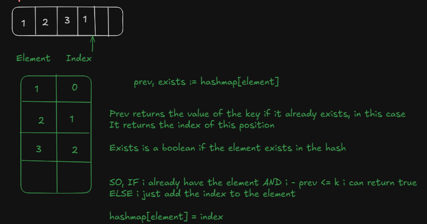

## Sliding Window

Sliding window é uma técnica utilizada para resolver problemas em que precisamos encontrar ou verificar um subarray que satisfaça uma determinada condição. Uma vez que a condição é atendida, retornamos os índices, um valor booleano ou algum outro resultado.

Eu realmente gosto deste problema ([Contains Duplicate II](https://leetcode.com/problems/contains-duplicate-ii/)) e da ideia para resolvê-lo:

A ideia principal aqui é usar um hashmap desta maneira:

- A "Chave" do hashmap é o nosso valor/elemento no array
- O "Valor" da "Chave" do hashmap é o índice em que o elemento aparece

Com estes dois pontos em mente, temos tudo o que precisamos para resolvê-lo:

Iteramos pelo array de inteiros e verificamos:

- Se o elemento atual já existe em nosso hashmap, satisfazemos a condição `nums[i] == nums[j]`, porque se já existe, temos duas ocorrências do mesmo número
- Se a diferença entre seus índices (j - i) é menor ou igual a K, retornamos verdadeiro

Usei Go para esta solução:

```go
func containsNearbyDuplicate(nums []int, k int) bool {
	// Cria o hashmap
	h := make(map[int]int)

	// Itera sobre o array
	for index,element := range nums {
		// Obtém o índice anterior no hashmap se o elemento existir
		prevIndex, elementExists := h[element]

		// Verifica se o elemento tem duas ocorrências (nums[i] == nums[j])
		// e se a diferença de índices (index - prevIndex) é <= k
		if elementExists && index - prevIndex <= k {
			return true
		}
		// Se o elemento não existir, adicionamos ao hashmap
		h[element] = index
	}
	return false
}
```

---

```cs
bool ContainsNearbyDuplicate(int[] nums, int k) {
  Dictionary<int, int> dic = new Dictionary<int, int>();
  var end = 0;
  while (end < nums.Length) {
    int element = nums[end];
    if (dic.TryGetValue(element, out int value) && Math.Abs(end - value) <= k) {
      return true;
    }

    dic[element] = end;
    end++;

  }

  return false;
}
```

A ideia é a mesma para ambos os códigos acima.

Aqui está um esboço simples descrevendo a lógica que usei para resolver este problema (com go, mas a ideia é a mesma com C#)

