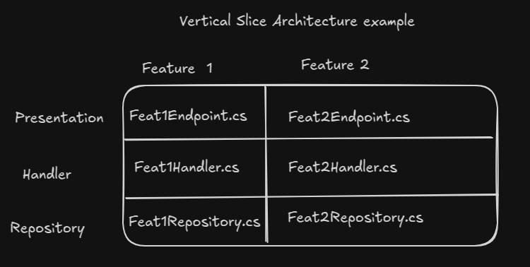

## Introdução

### O que você pode esperar deste blog

O leitor aprenderá como e por que implementar serviços de fila em uma aplicação .NET, além de aprender o conceito de VSA (Arquitetura Vertical Slice) e como configurar um docker compose para esta aplicação.

### Pré-requisitos

Familiaridade com .NET, Docker, conceitos de API e princípios RESTful, um pouco sobre DDD e conhecimento na linguagem C#.

### Construindo um Sistema de Votação?

Não me lembro exatamente quando, mas me deparei com este [desafio](https://dev.to/zanfranceschi/desafio-sistema-de-votacao-bbb-50e3) através de um tweet.

Ele fala sobre uma discussão sobre como nós brasileiros estávamos pensando em como um site de um reality show poderia suportar milhares de requisições por segundo e ainda ter um tempo de resposta rápido.

Neste artigo, o autor introduz o conceito de serviços de fila e como eles podem ajudar a suportar essas milhares de requisições. Basicamente consiste em duas etapas:

1. A API recebe uma requisição para votar em um candidato, então publica este voto em uma fila, e o mais rápido possível, a API retorna algum tipo de Voto aceito (202)
2. Em seguida, o próximo passo é realmente salvar esse voto em um banco de dados. Criamos um consumidor que será executado de forma assíncrona para consumir a fila e salvar o voto no banco de dados

O desafio sugere o uso do RabbitMQ para resolvê-lo, e este é o que vamos usar. Quanto à linguagem de programação, sinta-se à vontade para escolher qualquer uma de sua preferência, mas fique atento a alguns conceitos que vamos trabalhar durante este post:

- Workers em Segundo Plano
- Serviços de Fila
- Integração com o banco de dados
- Arquitetura Vertical Slice

Se você só quer verificar a implementação da solução, pode ir para este [repositório](https://github.com/Viilih/VSA-voting-system) e ler o arquivo README.md com as instruções.

## Entendendo a Arquitetura Vertical Slice

### O que é Arquitetura Vertical Slice? (VSA)

É uma arquitetura centrada em recursos, onde você divide sua aplicação por funcionalidades e não por outras camadas, como Apresentação, Aplicação, Domínio que está presente na Arquitetura Limpa. Aqui está um esboço simples sobre como a VSA funciona:

O foco da VSA é isolar cada funcionalidade, criando uma aplicação menos acoplada entre as funcionalidades, onde cada funcionalidade tem seus próprios arquivos, serviços e lógica de negócios.

### Vantagens e desvantagens

Na aplicação que vamos construir, usaremos os princípios e conceitos da Arquitetura Vertical Slice. Como qualquer outra arquitetura, ela tem suas próprias vantagens e desvantagens:

Vantagens:

- Cada funcionalidade é independente
- As equipes podem trabalhar sem interferir no trabalho umas das outras
- Menos acoplamento
- Fácil de entender o que sua aplicação faz

Desvantagens:

- Você pode escrever código similar ou idêntico mais de uma vez
- Funcionalidades compartilhadas precisam de planejamento cuidadoso
- Você pode ter muitos arquivos em sua aplicação devido à separação de funcionalidades

### Quando usar VSA?

Bem, a resposta para a segunda pergunta é: **Depende**
Como disse antes, cada Arquitetura tem seus próprios compromissos e você precisa analisá-los para escolher o melhor para sua necessidade.

Nesta aplicação, escolhi a VSA devido ao tamanho da nossa aplicação e a facilidade de implementar a VSA.

### Recursos para aprender mais

Se você quiser se aprofundar neste conceito, aqui estão alguns bons recursos:

- [Maneiras de implementar a Arquitetura Vertical Slice](https://antondevtips.com/blog/vertical-slice-architecture-the-best-ways-to-structure-your-project)
- [Introdução à Arquitetura Vertical Slice](https://www.milanjovanovic.tech/blog/vertical-slice-architecture)
- [Arquitetura Vertical Slice](https://www.jimmybogard.com/vertical-slice-architecture/)
- [Implementação de Vertical Slice](https://www.youtube.com/watch?v=T-EwN9UqRwE&t=1471s)

NOTA: O foco deste post é resolver o desafio que vou abordar nos próximos parágrafos, mas acredito que é importante contextualizar você, meu leitor, sobre a forma como vamos implementar a solução.

## Configuração e Implementação do Projeto

### Configuração inicial do projeto

Para configurar a estrutura que vamos usar, você pode simplesmente copiar isso no seu terminal, basicamente ele cria uma solução e adiciona uma API à pasta src:

```cs
# Criar uma nova solução
dotnet new sln -n voting-system

# Criar pastas do projeto
mkdir src mkdir "Solution Items"

# Navegar até a pasta src e criar um projeto de API web
cd src
dotnet new webapi -n votingSystem.Api --no-minimal

# Criar diretório de teste dentro de src
mkdir test

# Adicionar o projeto de API à solução cd ..
dotnet sln add src/votingSystem.Api/votingSystem.Api.csproj

dotnet add package FluentResults --version 3.16.0
```

Depois disso, estamos prontos para começar nosso projeto

### Entidades de domínio (Candidato e Voto)

Bem, o desafio envolve basicamente duas entidades:

- Candidato - Representa um candidato que pode receber votos.
- Voto - Representa um voto individual dado a um candidato.
  Como um candidato pode receber múltiplos votos à medida que o período de votação continua, vamos definir essas entidades na pasta **Domain**:

```cs
// votingSystem.Api/Domain/Candidate.cs
public class Candidate {
  public int Id {
    get;
    private set;
  }
  public string Name {
    get;
    private set;
  }

  public List <Vote> Votes {
    get;
    private set;
  }

  private Candidate(string name) {
    Name = name;
  }

  public static Result <Candidate> Create(string name) {
    if (string.IsNullOrWhiteSpace(name)) {
      return Result.Fail <Candidate> ("Name cannot be null or empty");
    }

    return Result.Ok(new Candidate(name));
  }
}
```

---

```cs
// votingSystem.Api/Domain/Vote.cs
public class Vote {
  public Guid Id {
    get;
    private set;
  }

  public int CandidateId {
    get;
    private set;
  }

  public virtual Candidate Candidate {
    get;
    private set;
  }

  private Vote(int candidateId) {
    Id = Guid.NewGuid();
    CandidateId = candidateId;
  }

  public static Result <Vote> Create(int candidateId) {
    if (candidateId < 1) {
      return Result.Fail <Vote> ("CandidateId cannot be null or empty");
    }

    return Result.Ok(new Vote(candidateId));
  }
}
```

Você pode estar pensando, por que estamos usando esse padrão de construtor privado e usando essa biblioteca usando **Result.Ok** ou **Result.Fail**?

Basicamente porque isso pode ajudar você a escalar seu projeto e ajudar a definir suas regras de negócio para suas entidades.

Ao usar um **método de fábrica** (Create), garantimos que a entidade esteja sempre em um estado válido antes de ser criada. Esse padrão também ajuda a prevenir inconsistências na instanciação de objetos e mantém a lógica de validação dentro do domínio, tornando a base de código mais limpa e mais fácil de manter a longo prazo.

### Configuração do banco de dados

Vamos usar o SQL Server, para utilizá-lo precisamos fazer algumas configurações e instalar alguns pacotes, são eles:

```bash
dotnet add package Microsoft.EntityFrameworkCore --version 8.0.11
dotnet add package Microsoft.EntityFrameworkCore.SqlServer --version 8.0.11
dotnet add package Microsoft.EntityFrameworkCore.Tools --version 8.0.11
dotnet add package Microsoft.VisualStudio.Web.CodeGeneration.Design --version 8.0.7
```

### AVISO

Se preferir, você pode instalá-los através do seu Nuget Manager Packet.

### Configurando o DbContext

Para configurar nosso contexto de banco de dados, vamos usar a pasta `Infrastructure` para manter tanto a configuração do banco de dados quanto o serviço de fila dentro dela:

```cs
// Infrastructure/DbContext/VoteSystemDbContext.cs
public class VoteSystemDbContext: Microsoft.EntityFrameworkCore.DbContext {
  public DbSet <Candidate> Candidates {
      get;
      set;
    } =
    default!;

  public DbSet <Vote> Votes {
      get;
      set;
    } =
    default !;

  public VoteSystemDbContext(DbContextOptions <VoteSystemDbContext> options): base(options) {}

  protected override void OnModelCreating(ModelBuilder modelBuilder) {
    modelBuilder.ApplyConfigurationsFromAssembly(typeof (VoteSystemDbContext).Assembly);

    modelBuilder.Entity <Vote> (entity => {
      entity.HasKey(e => e.Id);

      entity.HasOne(e => e.Candidate)
        .WithMany(c => c.Votes)
        .HasForeignKey(e => e.CandidateId)
        .IsRequired();
    });

    modelBuilder.Entity <Candidate> (entity => {
      entity.HasKey(e => e.Id);
    });
  }
}
```

Também definimos o relacionamento entre nossas entidades:

- Um candidato pode ter muitos votos

No seu `Program.cs`, você precisa adicionar este `DbContext` para inicializá-lo dentro da aplicação. Para fazer isso, basta adicionar o seguinte código no seu `Program.cs`:

```cs
builder.Services.AddDbContext <VoteSystemDbContext> (options => options.UseSqlServer(builder.Configuration.GetConnectionString("DefaultConnection"),
  b => b.MigrationsAssembly("votingSystem.Api")));
```

Apenas um lembrete rápido—se você não está muito familiarizado com o .NET, você precisa configurar uma **ConnectionString** no seu `appsettings.json`. Aqui está um exemplo:

```json
"ConnectionStrings": {
  "DefaultConnection": "Server=localhost;Database=VoteSystemDB;User Id=sa;Password=@RandomPassword12345!;TrustServerCertificate=True;"
}
```

Após esta configuração, estamos prontos para iniciar nosso banco de dados. No meu caso, como uso Linux, me senti mais confortável apenas executando um contêiner usando o comando:

```bash
 docker run -e "ACCEPT_EULA=Y" -e "MSSQL_SA_PASSWORD=@RandomPassword12345!" \
   -p 1433:1433 --name sql1 --hostname sql1 \
   -d \
   mcr.microsoft.com/mssql/server:2022-latest

```

No entanto, se você já tem o SQL Server rodando localmente em sua máquina, sinta-se à vontade para ignorar o comando acima.

### Criando migrações

Agora, precisamos criar e aplicar migrações para gerar nosso banco de dados com as tabelas e relacionamentos necessários. O **EF Core** fornece comandos para ajudar com isso:

```bash
dotnet ef migrations add InitialMigration
```

---

```bash
dotnet ef database update
```

E é isso—temos nosso banco de dados configurado!

### Implementação do repositório

Para lidar com operações de banco de dados, vamos usar repositórios. Eles serão bastante simples, mas à medida que os configuramos, precisamos começar a pensar nas funcionalidades que vamos fornecer.

Ao considerar a entidade **Candidate**, não podemos permitir votar em um candidato que não existe, então precisamos garantir que podemos criar um candidato primeiro.

Crie uma pasta **Features**, e dentro dela, organize cada contexto em pastas separadas, assim:


Na pasta Candidates:

```cs
// Features/Candidates/ICandidateRepository.cs
public interface ICandidateRepository {
  Task AddAsync(Candidate candidate);

  Task <Candidate?> FindCandidateById(int id);
}
```

---

```cs
// Features/Candidates/CandidateRepository
public class CandidateRepository: ICandidateRepository {
  private readonly VoteSystemDbContext _dbContext;

  public CandidateRepository(VoteSystemDbContext dbContext) {
    _dbContext = dbContext;
  }

  public async Task AddAsync(Candidate candidate) {
    await _dbContext.Candidates.AddAsync(candidate);
    await _dbContext.SaveChangesAsync();
  }

  public async Task <Candidate?> FindCandidateById(int candidateId) {
    return await _dbContext.Candidates.FirstOrDefaultAsync(v => v.Id == candidateId);
  }
}
```

A mesma lógica se aplica à entidade Vote, mas neste caso só precisamos inserir o voto no banco de dados:

```cs
// Features/Votes/IVoteRepository.cs
public interface IVoteRepository {
  Task AddVote(Vote vote);
}

```

---

```cs
// Feature/Votes/VoteRepository.cs
public class VoteRepository: IVoteRepository {
  private readonly VoteSystemDbContext _dbContext;

  public VoteRepository(VoteSystemDbContext dbContext) {
    _dbContext = dbContext;
  }

  public async Task AddVote(Vote vote) {
    await _dbContext.Votes.AddAsync(vote);
    await _dbContext.SaveChangesAsync();
  }
}
```

Depois de criar todos esses arquivos, precisamos lidar com a **injeção de dependência** para os repositórios em `Program.cs`.

Para fazer isso, adicione as seguintes linhas a `Program.cs`:

```cs
// Program.cs
builder.Services.AddScoped <IVoteRepository, VoteRepository> ();
builder.Services.AddScoped <ICandidateRepository, CandidateRepository> ();
```

Com nosso repositório de candidatos pronto, podemos criar o handler e o endpoint para criar os Candidatos:

```cs
// Features/Candidates/CreateCandidate/CreateCandidateHandler
using FluentResults;
using votingSystem.Api.Domain;
using votingSystem.Api.Features.Candidates.CreateCandidate;

namespace votingSystem.Api.Features.Candidates.CreateCandidate;

public class CreateCanidadateHandler {
  private readonly ICandidateRepository _candidateRepository;

  public CreateCanidadateHandler(ICandidateRepository candidateRepository) {
    _candidateRepository = candidateRepository;
  }

  public async Task <Result<CreateCandidateResponse>> Handle(CreateCandidateRequest request) {
    try {
      var candidateResult = Candidate.Create(request.name);

      if (candidateResult.IsFailed) {
        return Result.Fail <CreateCandidateResponse> (candidateResult.Errors);
      }

      var candidate = candidateResult.Value;
      await _candidateRepository.AddAsync(candidate);

      var createCandidateResponse = new CreateCandidateResponse(candidate.Id, candidate.Name);

      return Result.Ok <CreateCandidateResponse> (createCandidateResponse);
    } catch (Exception e) {
      return Result.Fail <CreateCandidateResponse> (e.Message);
    }
  }
}
public record CreateCandidateRequest(string name);

public record CreateCandidateResponse(int Id, string Name);
```

```cs
// Features/Candidates/CreateCandidate/CreateCandidateController
using Microsoft.AspNetCore.Http;
using Microsoft.AspNetCore.Mvc;
using votingSystem.Api.Features.Candidates.CreateCandidate.HTTP;

namespace votingSystem.Api.Features.Candidates.CreateCandidate {
  [Route("api/[controller]")]
  [ApiController]
  public class CreateCandidateController: ControllerBase {

    private readonly CreateCanidadateHandler _handler;
    public CreateCandidateController(CreateCanidadateHandler handler) {
        _handler = handler;
      }
      [HttpPost("create-candidate")]
    public async Task < IActionResult > CreateCandidate(CreateCandidateRequest request) {
      var result = await _handler.Handle(request);
      if (result.IsSuccess) {
        return Ok(result.Value);
      }
      return BadRequest(result.Errors);
    }
  }
}

```

## Entendendo Message Brokers

### O que é um message broker?

É um software que permite que aplicações se comuniquem entre si e troquem informações, podemos pensar nele como uma espécie de caixa de correio.

### Produtores e Consumidores

Quando se fala em Message Brokers, é importante pensar em alguns pontos:

- O Serviço que está enviando uma mensagem para o message broker é chamado de Produtor
- O Serviço recebendo a mensagem é chamado de consumidor

Aqui está um esboço simples sobre como um message broker funciona:


Vamos usar o message broker RabbitMq, e a comunicação do Produtor e Consumidor com o RabbitMq ocorre através do [Protocolo AMQP](https://www.rabbitmq.com/tutorials/amqp-concepts)

### Por que estamos usando RabbitMq?

Você pode estar pensando, Por que estamos usando RabbitMQ?

Principalmente por dois motivos:

- Para estudar e entender como os message brokers funcionam
- Para dar uma resposta rápida ao usuário ao tentar interagir com a API através da UI

Para melhorar a experiência do usuário ao votar em alguém em um reality show, PRECISAMOS mostrar ao usuário que seu voto foi aceito o mais rápido possível, e com isso tornaremos o público mais engajado com o reality show.

Mas como podemos fazer isso?

Em um cenário com milhares de requisições, publicar mensagens em um sistema de filas para processamento assíncrono é geralmente mais rápido e eficiente do que lidar com um grande número de interações diretas com o banco de dados. As filas ajudam a distribuir a carga de trabalho, evitam sobrecarga do banco de dados e melhoram a escalabilidade do sistema, permitindo que as mensagens sejam processadas de forma independente e em um ritmo controlado.

## Implementando o Sistema de Filas

### Configuração do RabbitMq

Agora que sabemos o que é um Message Broker, vamos escolher um dentre muitos deles: RabbitMq

O RabbitMq armazena suas mensagens em um formato de fila (FIFO) com os produtores publicando as mensagens na fila e os consumidores consumindo e removendo-as da fila.

#### Implementando o Produtor

Dentro da pasta `Infrastructure`, crie uma subpasta chamada `Messaging`, e dentro dela, outra subpasta chamada `RabbitMq`. Em seguida, crie a classe `RabbitMqProducer` e a interface `IRabbitMqProducer`.

```cs
// Infrastructure/Messaging/RabbitMq/IRabbitMqProducer.cs
public interface IRabbitMqProducer
{
    void SendMessage<T>(T message);
}
```

```cs
// Infrastructure/Messaging/RabbitMq/RabbitMqProducer.cs
public class RabbitMqProducer: IRabbitMqProducer {
  public void SendMessage <T> (T message) {
    var factory = new ConnectionFactory {
      HostName = "localhost", UserName = "guest", Password = "guest", Port = 5672, VirtualHost = "/"
    };
    using
    var connection = factory.CreateConnection();
    using
    var channel = connection.CreateModel();
    channel.QueueDeclare("vote", durable: true, exclusive: false, autoDelete: false, arguments: null);

    var json = JsonConvert.SerializeObject(message);
    var body = Encoding.UTF8.GetBytes(json);
    channel.BasicPublish("", "vote", null, body);
  }
}
```

PARA RESUMIR O PROCESSO:

1. Criar uma conexão com o contêiner RabbitMQ em execução
2. Declarar a fila que você vai usar e suas configurações
3. Codificar a mensagem para publicar na fila que você declarou

Agora que temos nosso Produtor, podemos implementar um endpoint e um handler para receber uma solicitação para enviar um voto:

```cs
// Features/Votes/SubmitVote/SubmitVoteHandler.cs
using FluentResults;
using votingSystem.Api.Features.Candidates;
using votingSystem.Api.Infrastructure.Messaging.RabbitMQ;

namespace votingSystem.Api.Features.Votes.SubmitVote;

public class SubmitVoteHandler {
  private readonly IRabbitMqProducer _rabbitMqProducer;
  private readonly ICandidateRepository _candidateRepository;

  public SubmitVoteHandler(IRabbitMqProducer rabbitMqProducer, ICandidateRepository candidateRepository) {
    _rabbitMqProducer = rabbitMqProducer;
    _candidateRepository = candidateRepository;
  }

  public async Task <Result<SubmitVoteResponse>> Handle(SubmitVoteRequest request) {
    if (request.CandidateId < 1) {
      return Result.Fail <SubmitVoteResponse> ("Invalid candidate Id");
    }

    var candidate = await _candidateRepository.FindCandidateById(request.CandidateId);

    if (candidate == null) {
      return Result.Fail <SubmitVoteResponse> ("Candidate not found");
    }
    _rabbitMqProducer.SendMessage(request.CandidateId);

    var submitVoteResponse = new SubmitVoteResponse(request.CandidateId);

    return Result.Ok <SubmitVoteResponse> (submitVoteResponse);

  }
}
public record SubmitVoteRequest(int CandidateId);
public record SubmitVoteResponse(int CandidateId);
```

E o endpoint se parece com isso:

```cs
// Features/Votes/SubmitVote/SubmitVoteController.cs
using Microsoft.AspNetCore.Mvc;
using votingSystem.Api.Features.Votes.SubmitVote;

namespace votingSystem.Api.Features.Votes.SubmitVote;

[Route("api/[controller]")]
[ApiController]
public class SubmitVoteController: ControllerBase {

  private readonly SubmitVoteHandler _handler;

  public SubmitVoteController(SubmitVoteHandler handler) {
      _handler = handler;
    }
    [HttpPost("submit-vote")]
  public async Task <IActionResult> SubmitVote([FromBody] SubmitVoteRequest request) {
    var result = await _handler.Handle(request);
    if (result.IsFailed) {
      return BadRequest(result.Errors);
    }
    return Ok(result);
  }

}
```

#### Implementando o Consumidor:

Assim como fizemos para enviar o voto para a fila, para processar o voto, lidar com eles e interagir com o banco de dados, precisamos criar um handler:

```cs
using FluentResults;
using votingSystem.Api.Domain;

namespace votingSystem.Api.Features.Votes.ProcessVote;

public class ProcessVoteHandler {
  private readonly IVoteRepository _voteRepository;

  public ProcessVoteHandler(IVoteRepository voteRepository) {
    _voteRepository = voteRepository;
  }

  public async Task < Result > Handle(int candidateId) {
    var candidate = await _voteRepository.FindCandidateById(candidateId);
    if (candidate == null) {
      return Result.Fail("Candidate not found");
    }

    var voteToAdd = Vote.Create(candidateId);
    if (voteToAdd.IsFailed) {
      return Result.Fail("Invalid vote");
    }

    try {
      await _voteRepository.AddVote(voteToAdd.Value);
      return Result.Ok();
    } catch (InvalidOperationException ex) {
      return Result.Fail(ex.Message);
    }
  }
}

```

Na pasta `RabbitMq`, crie outro arquivo chamado RabbitMqConsumer.cs:

```cs
public class RabbitMqConsumer: BackgroundService {
  private readonly IServiceProvider _serviceProvider;
  private readonly ILogger <RabbitMqConsumer> _logger;
  private IConnection _connection;
  private IModel _channel;

  public RabbitMqConsumer(ILogger < RabbitMqConsumer > logger, IServiceProvider serviceProvider) {
    _logger = logger;
    _serviceProvider = serviceProvider;
  }

  protected override async Task ExecuteAsync(CancellationToken stoppingToken) {
    _logger.LogInformation("Worker starting at: {time}", DateTimeOffset.Now);

    TimeSpan delay = TimeSpan.FromSeconds(5);
    try {
      var factory = new ConnectionFactory() {
        HostName = "localhost",
          UserName = "guest",
          Password = "guest",
          Port = 5672,
      };

      _connection = factory.CreateConnection();
      _channel = _connection.CreateModel();

      _channel.QueueDeclare("vote",
        durable: true,
        exclusive: false,
        autoDelete: false,
        arguments: null);

      var consumer = new EventingBasicConsumer(_channel);

      consumer.Received += async (model, ea) => {
        var body = ea.Body.ToArray();
        var message = Encoding.UTF8.GetString(body);
        _logger.LogInformation("Received: {Message}", message);
        if (int.TryParse(message, out int candidateId)) {
          await ProcessVote(candidateId);
        }
        _channel.BasicAck(ea.DeliveryTag, false);
      };

      _channel.BasicConsume(queue: "vote",
        autoAck: false,
        consumer: consumer);

      _logger.LogInformation("Successfully connected to RabbitMQ");

    } catch (Exception ex) {

      _logger.LogWarning($"Failed to connect to RabbitMQ: {ex.Message}");
      await Task.Delay(delay, stoppingToken);
    }

  }

  private async Task ProcessVote(int candidateId) {
    using(var scope = _serviceProvider.CreateScope()) {
      var processVoteHandler = scope.ServiceProvider.GetRequiredService < ProcessVoteHandler > ();
      var result = await processVoteHandler.Handle(candidateId);

      if (result.IsSuccess) {
        _logger.LogInformation($"Vote for candidate {candidateId} processed successfully.");
      } else {
        _logger.LogError($"Failed to process vote for candidate {candidateId}: {result.Errors[0].Message}");
      }
    }
  }

  public override async Task StopAsync(CancellationToken cancellationToken) {
    _channel?.Close();
    _connection?.Close();
    await base.StopAsync(cancellationToken);
  }
}
```

Resumindo o processo:

1. **Estabelecer uma conexão com o RabbitMQ**: Configurar e criar uma conexão com o broker RabbitMQ.
2. **Declarar uma fila**: Garantir que a fila `vote` exista com as configurações adequadas.
3. **Consumir mensagens**: Escutar mensagens recebidas, processá-las e confirmar o recebimento.
4. **Processar votos**: Extrair o conteúdo da mensagem e passá-lo para o `ProcessVoteHandler` para processamento.

### Entendendo Serviços em Segundo Plano?

Um `BackgroundService` no .NET é um tipo especial de serviço que roda em segundo plano enquanto sua aplicação está em execução. Pense nele como um **trabalhador** que continuamente realiza uma tarefa sem bloquear a aplicação principal.

No nosso exemplo, o serviço em segundo plano é responsável por ouvir e consumir a fila e lidar com as operações com o banco de dados.

Você pode verificar informações mais detalhadas de como os Serviços em Segundo Plano funcionam na [documentação oficial](https://learn.microsoft.com/en-us/aspnet/core/fundamentals/host/hosted-services?view=aspnetcore-9.0&tabs=visual-studio)

## Atualizando o Program.cs

Após todas essas configurações, você pode atualizar seu arquivo Program.cs, ele deve ficar assim:

```cs
using Microsoft.EntityFrameworkCore;
using votingSystem.Api.Features.Candidates;
using votingSystem.Api.Features.Candidates.CreateCandidate;
using votingSystem.Api.Features.Votes;
using votingSystem.Api.Features.Votes.ProcessVote;
using votingSystem.Api.Features.Votes.SubmitVote;
using votingSystem.Api.Infrastructure.DbContext;
using votingSystem.Api.Infrastructure.Messaging.RabbitMQ;

var builder = WebApplication.CreateBuilder(args);

// Adiciona serviços ao container.

builder.Services.AddDbContext<VoteSystemDbContext>(options => options.UseSqlServer(builder.Configuration.GetConnectionString("DefaultConnection"),
  b => b.MigrationsAssembly("votingSystem.Api")));

builder.Services.AddControllers();
// Saiba mais sobre configurações de Swagger/OpenAPI em https://aka.ms/aspnetcore/swashbuckle
builder.Services.AddEndpointsApiExplorer();
builder.Services.AddSwaggerGen();
builder.Services.AddScoped<IVoteRepository, VoteRepository>();
builder.Services.AddScoped<ICandidateRepository, CandidateRepository>();
builder.Services.AddScoped<CreateCanidadateHandler>();
builder.Services.AddScoped<SubmitVoteHandler>();
builder.Services.AddScoped<ProcessVoteHandler>();
builder.Services.AddHostedService<RabbitMqConsumer>();
builder.Services.AddScoped<IRabbitMqProducer, RabbitMqProducer>();

var app = builder.Build();

// Temos isso para aplicar automaticamente as migrações ao banco de dados
using(var scope = app.Services.CreateScope()) {
  var context = scope.ServiceProvider.GetRequiredService<VoteSystemDbContext>();
  context.Database.Migrate();
}

// Configurar o pipeline de requisições HTTP.
if (app.Environment.IsDevelopment()) {
  app.UseSwagger();
  app.UseSwaggerUI();
}

app.UseHttpsRedirection();

app.UseAuthorization();

app.MapControllers();

app.Run();
```

## Executando a aplicação

### Opções de configuração de contêiner

Você pode executar cada contêiner do SQL Server e do RabbitMQ com estes comandos:

SQL SERVER:

```bash
docker run -e "ACCEPT_EULA=Y" -e "MSSQL_SA_PASSWORD=@RandomPassword12345!" \
   -p 1433:1433 --name sql1 --hostname sql1 \
   -d \
   mcr.microsoft.com/mssql/server:2022-latest

```

RabbitMQ:

```bash
docker run -it --rm --name rabbitmq -p 5672:5672 -p 15672:15672 rabbitmq:4.0-management
```

### Usando docker compose

Você também pode configurar um arquivo docker compose para executar todos esses serviços para você e apenas executar sua API localmente.

Se quiser fazer isso, crie um arquivo compose.yaml como este:

```yaml
services:
  sqlserver:
    image: mcr.microsoft.com/mssql/server:2022-latest
    environment:
      - ACCEPT_EULA=Y
      - MSSQL_SA_PASSWORD=@RandomPassword12345!
    ports:
      - "1433:1433"
    volumes:
      - sql-volume:/var/opt/mssql
    networks:
      - voting-network
  rabbitmq:
    image: rabbitmq:4-management
    container_name: rabbitmq
    hostname: rabbitmq
    ports:
      - "5672:5672"
      - "15672:15672"
    volumes:
      - rabbitmq_data:/var/lib/rabbitmq
    networks:
      - voting-network

networks:
  voting-network:

volumes:
  rabbitmq_data:
  sql-volume:
```

e então basta executar o comando:

```bash
docker compose up
```

E seja feliz :)

## Conclusão

### O que você aprendeu?

Apresentamos alguns conceitos sobre message brokers e como eles podem ser aplicados em uma aplicação e um exemplo de seus casos de uso

Aprendemos sobre Arquitetura de Vertical Slice

Como aplicar o docker para executar alguns serviços para ajudar durante o desenvolvimento

#### Quais são os próximos passos?

Acredito que seria uma boa ideia tentar criar algum projeto que VOCÊ pensou e tentar implementar um serviço de fila e aplicar o docker durante o seu desenvolvimento

Tente aplicar VSA e veja se funciona para seus desafios/projetos

Sua imaginação é o limite do que você vai fazer com as ferramentas que abordamos hoje

Espero que tenha gostado da leitura e lembre-se: É importante comer frutas e beber água
